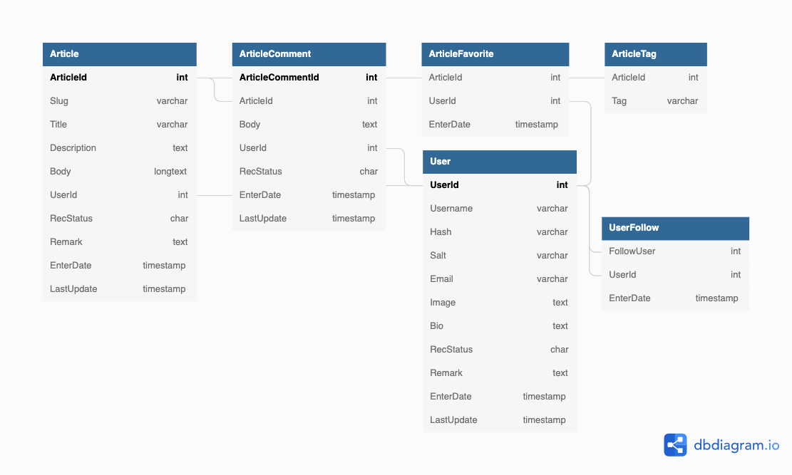

# 

> ### Example Node (Express + MySql) codebase containing real world examples (CRUD, auth, advanced patterns, etc) that adheres to the [RealWorld](https://github.com/gothinkster/realworld-example-apps) API spec.

This repo is functionality complete — PRs and issues welcome!

# Getting started

To get the Node server running locally:

 - Clone this repository
 - `yarn install` to install all required dependencies
 - Create the required tables on MySql database from [this](src/db.sql) file.
 - Create a .env file which includes:

| Variable | Description |
| -------- | ----------- |
| DATABASE_HOST | The hostname of the database you are connecting to. |
| DATABASE_PORT | The port number to connect to. (Default: 3306) |
| DATABASE_USER | The MySQL user to authenticate as. |
| DATABASE_PASSWORD | The password of that MySQL user |
| APP_PORT | The port number the server listen on (Default: 3100) |
| AUTH_SIGNATURE | The signature used to sign the json web token |

- `npm run dev` to start the local server

# Code Overview

## Dependencies

 - [express](https://github.com/expressjs/express) - The server for handling and routing HTTP requests
 - [express-joi-verifier](https://www.npmjs.com/package/express-joi-verifier) - Validating and formatting the HTTP requests' parameter or body
 - [knex](https://github.com/knex/knex) - For modeling and mapping MySql data to javascript 
 - [slugify](https://github.com/simov/slugify) - For encoding titles into a URL-friendly format
 - [winston](https://github.com/winstonjs/winston) - For logging the important information or error message

## Database Structure

You can find the details and relations of the database tables [here](https://dbdiagram.io/d/627dba0f7f945876b60d9c31).

## Application Structure

- `app.js` - The entry point to our application. This file defines our express server and connects it to MySql using knex. It also requires the routes and models we'll be using in the application.
- `index.route.js` - This folder contains the route definitions for our API.

## Error Handling

In `index.route.js`, we define a error-handling middleware for handling joi validation error. This middleware will respond with a 422 status code and format the response to have [error messages the clients can understand](https://github.com/gothinkster/realworld/blob/master/API.md#errors-and-status-codes)

## Authentication

Requests are authenticated using the `Authorization` header with a valid JWT. We define two express middlewares in `utils/auth.js` that can be used to authenticate requests. The `auth` middleware will return a 401 status code if the request cannot be authenticated. The payload of the JWT can then be accessed from `req.payload` in the endpoint. The `optional` middleware validate the incoming requests in the same way as `required`, but will *not* return a 401 status code if the request cannot be authenticated.

## Contributing

Pull requests are welcome. For major changes, please open an issue first to discuss what you would like to change.
Please make sure to update tests as appropriate.

## License
[MIT](LICENSE)